# Orion Agent Flow

This document describes the end-to-end flow of how Orion chat works in NoClickMail — from the dashboard UI through RAG routing, Corsair Gmail/Calendar actions, and the approval system.

---

## High-level overview

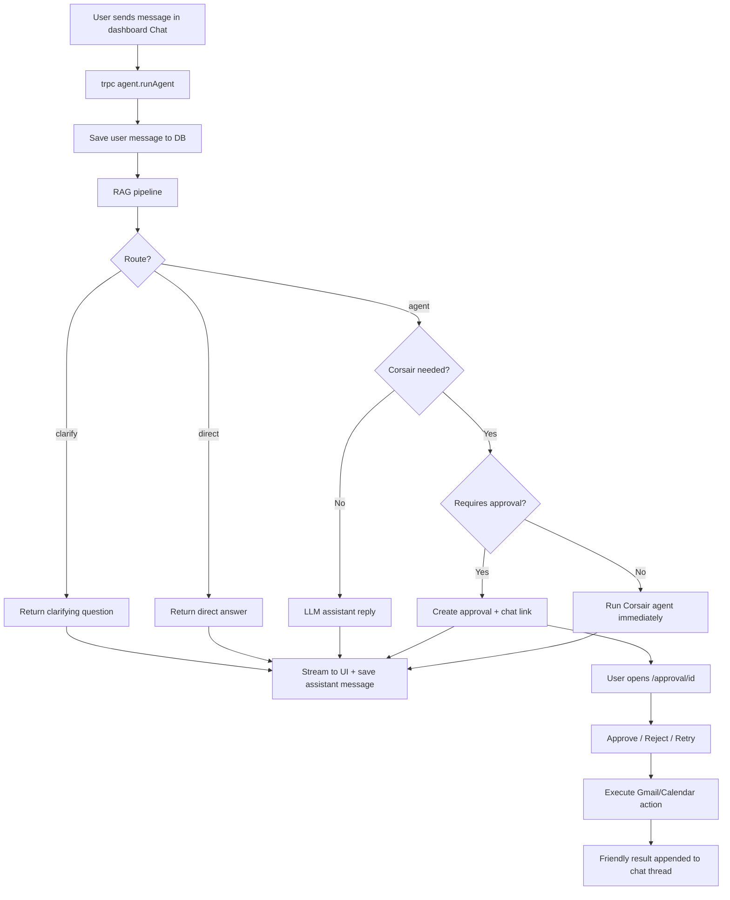

---

## 1. Frontend — dashboard chat

**Entry point:** `apps/web/components/ui/orion/dashboard/Chat.tsx`

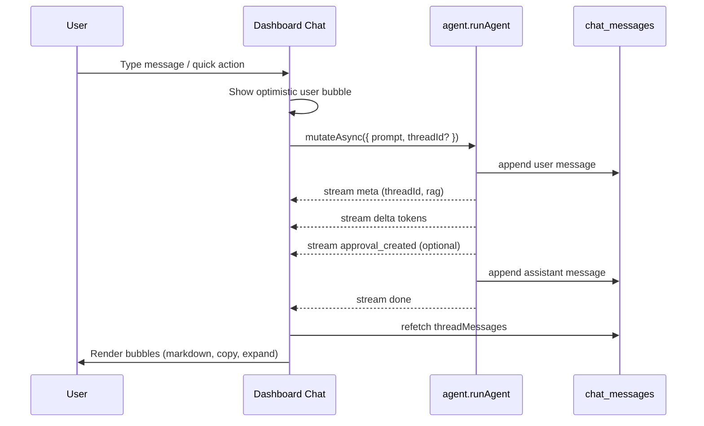

### UI behavior

| Message type | Rendering | Copy button |
|--------------|-----------|-------------|
| User | Plain text, truncated at ~320 chars; click to expand with scroll | Copies full message |
| Assistant | Full markdown (lists, bold, tables, CSV blocks) | Copies full message |
| Approval | Markdown + “Review approval” link | Copies **approval ID only** |
| Error | Plain destructive bubble | Copies error text |

**Note:** The separate `/chat` page is UI-only and is **not** wired to `agent.runAgent` yet. The live backend-connected chat is the Orion dashboard sidebar.

---

## 2. Backend — `agent.runAgent`

**Entry point:** `packages/trpc/server/routes/agent/route.ts`

```mermaid
flowchart LR
    A[Receive prompt] --> B[Get or create thread]
    B --> C[appendMessage user]
    C --> D[ragService.runForUserMessage]
    D --> E[yield meta event]
    E --> F[executeAgentTurn]
    F --> G[appendMessage assistant]
    G --> H[ragService.storeChatTurn]
    H --> I[yield done event]
```

Each turn:

1. **Thread** — reuse existing or create new from prompt snippet.
2. **Persist user message** — `chatService.appendMessage(role: "user")`.
3. **RAG** — `ragService.runForUserMessage(...)` decides routing.
4. **Stream meta** — `{ type: "meta", threadId, rag }` to client.
5. **Execute turn** — `executeAgentTurn(...)` in `run-agent-stream.ts`.
6. **Persist assistant message** — includes `content` and optional `approvalId`.
7. **Store in memory** — `ragService.storeChatTurn(...)` for long-term RAG.
8. **Stream done** — `{ type: "done", output, approvalId, rag }`.

---

## 3. RAG routing

**Entry point:** `packages/services/rag/index.ts`

The RAG determiner classifies each user message into one of three routes:

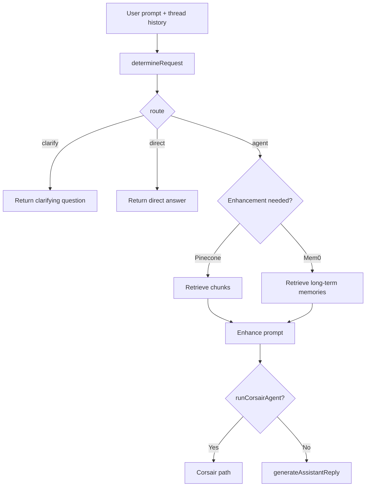

| Route | When | What happens |
|-------|------|----------------|
| **`clarify`** | Missing info | Returns a clarifying question immediately (no LLM agent call) |
| **`direct`** | Simple reply, no tools | Returns a canned/direct answer immediately |
| **`agent`** | Needs reasoning/tools | May retrieve from Pinecone, Mem0 memories, enhance prompt, then call Corsair or a normal assistant reply |

For the **`agent`** route, the flag **`runCorsairAgent`** (from `determination.requiresCorsairMcpTool`) decides whether Gmail/Calendar tools are needed.

---

## 4. Agent execution

**Entry point:** `packages/trpc/server/routes/agent/run-agent-stream.ts`

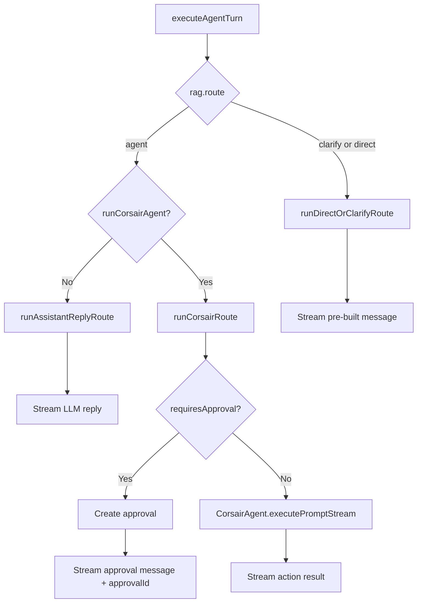

### Corsair planning

**Planner:** `packages/services/corsair-approvals/planner.ts`

The planner picks:

- **`service`:** `gmail` or `google_calendar`
- **`action`:** e.g. `send`, `search`, `create`, etc.
- **`parameters`:** to/subject/body, event fields, etc.

### Approval gate

**Function:** `requiresCorsairApproval()` in `planner.ts`

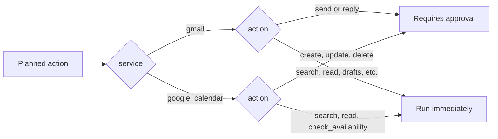

| Requires approval | Runs immediately |
|-------------------|------------------|
| Gmail: `send`, `reply` | Gmail: search, read, drafts, labels, etc. |
| Calendar: `create`, `update`, `delete` | Calendar: search, read, check_availability |

**If approval required:**

1. Insert row in `corsair_approval_events` (24h TTL).
2. Stream friendly message + `approval_created` event.
3. Save assistant message with `approvalId`.
4. Chat shows “Review approval” button linking to `/approval/[id]`.

**If no approval required:**

- `CorsairAgent.executePromptStream(...)` runs Gmail/Calendar directly.
- Streams deltas back to chat.

---

## 5. Approval flow

**Page:** `apps/web/app/(app)/approval/[id]/page.tsx`  
**API:** `packages/trpc/server/routes/corsair-approvals/route.ts`  
**Service:** `packages/services/corsair-approvals/index.ts`

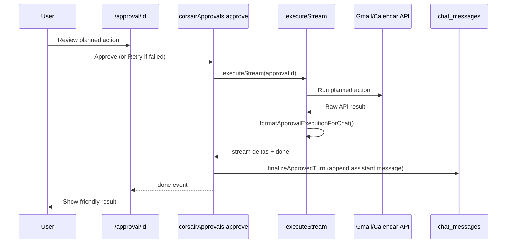

### User actions on approval page

| Action | Result |
|--------|--------|
| **Approve** | Executes action, appends friendly result to original chat thread |
| **Reject** | Sets status to `rejected`; no execution |
| **Retry** | Re-runs failed or stuck (`failed` / `executing`) approvals |

On execution:

- Gmail send uses sanitized MIME (fixes invalid `From: me` headers).
- OAuth tokens are refreshed via `ensureOAuthAccessToken()` before API calls.
- Raw API output is stored in DB; chat receives a **friendly formatted message** via `formatApprovalExecutionForChat()`.

---

## 6. Gmail / OAuth layer

**Files:** `packages/services/corsair/oauth.ts`, `packages/services/corsair/index.ts`

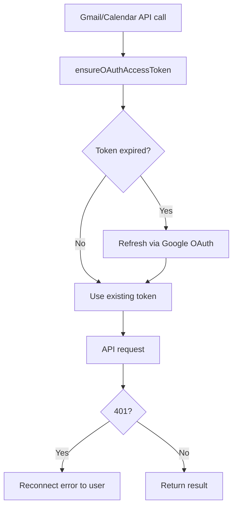

Before any Gmail/Calendar API call:

- **`getCorsairConnectionStatus()`** checks account exists **and** token is valid.
- **`ensureOAuthAccessToken()`** reads `expires_at`, refreshes via Google OAuth if needed.
- On 401, user gets a reconnect-style error.

---

## 7. Data stored per turn

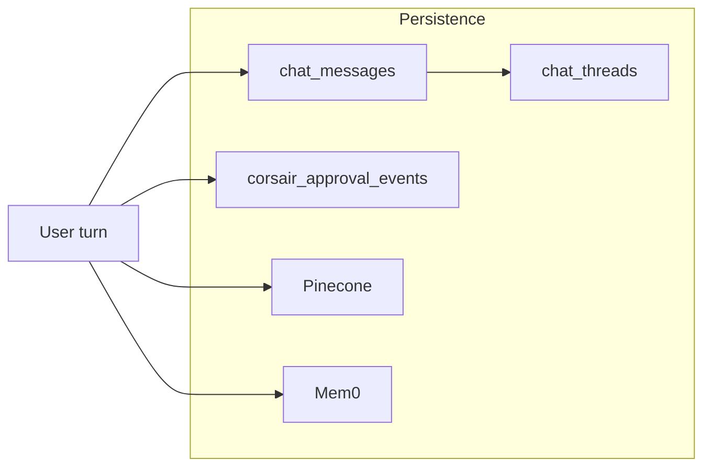

| Store | What |
|-------|------|
| `chat_threads` / `chat_messages` | Conversation history; `approvalId` on approval messages |
| `corsair_approval_events` | Pending/completed actions with parameters, status, result |
| Pinecone | Retrieved context chunks (when RAG flags require them) |
| Mem0 | Long-term memory (when RAG flags require them) |

---

## 8. Example walkthroughs

### Send email (requires approval)

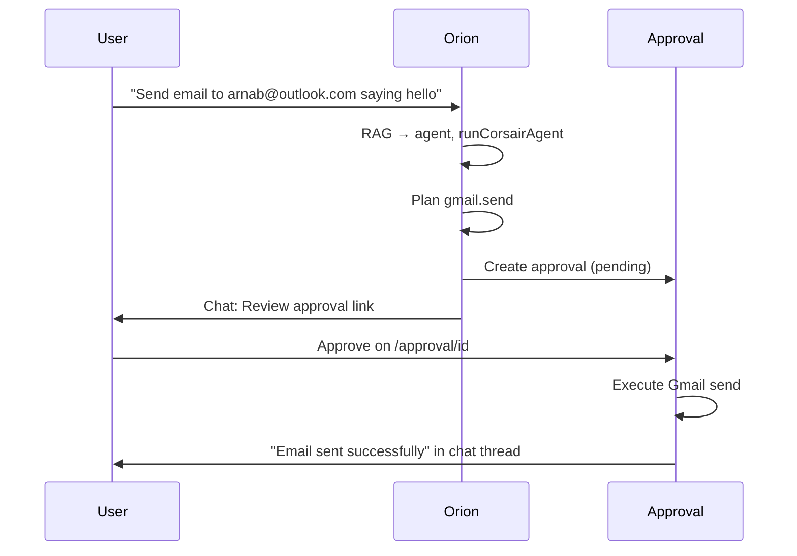

1. RAG → `agent` route, `runCorsairAgent: true`
2. Planner → `gmail.send` with to/subject/body
3. `requiresCorsairApproval` → **true**
4. Chat shows approval message + link
5. User approves on `/approval/[id]`
6. Email sends via Gmail API
7. Friendly result appears back in the chat thread

### Read inbox data (no approval)

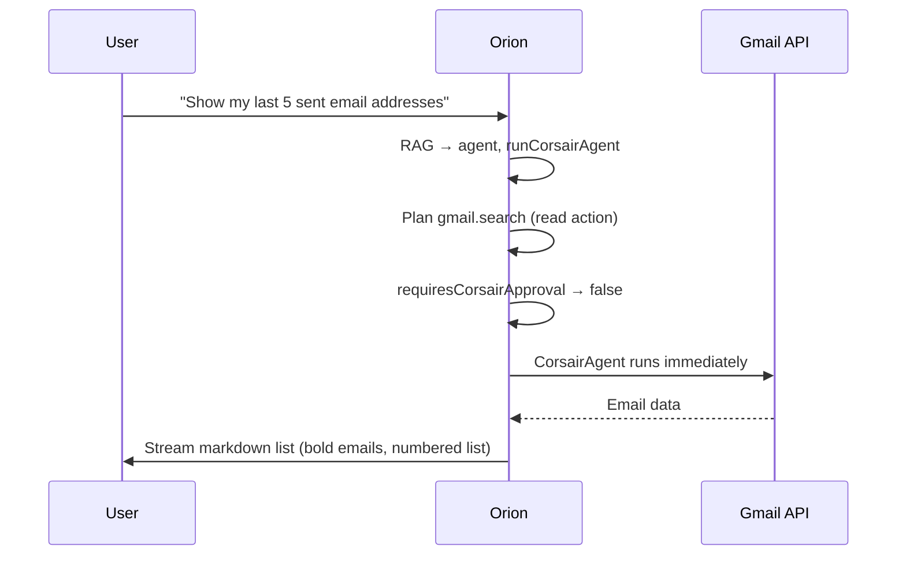

1. RAG → `agent` route, Corsair needed
2. Planner → `gmail.search` or similar read action
3. `requiresCorsairApproval` → **false**
4. Corsair runs immediately, streams markdown list
5. Chat renders with markdown formatting

---

## Key file reference

| Area | Path |
|------|------|
| Dashboard chat UI | `apps/web/components/ui/orion/dashboard/Chat.tsx` |
| Chat bubbles (markdown, copy, expand) | `apps/web/components/ui/orion/dashboard/ChatMessageBubble.tsx` |
| Markdown renderer | `apps/web/components/ui/orion/dashboard/ChatMarkdown.tsx` |
| Agent tRPC route | `packages/trpc/server/routes/agent/route.ts` |
| Agent stream execution | `packages/trpc/server/routes/agent/run-agent-stream.ts` |
| RAG pipeline | `packages/services/rag/index.ts` |
| Corsair approval service | `packages/services/corsair-approvals/index.ts` |
| Action planner + approval rules | `packages/services/corsair-approvals/planner.ts` |
| Approval execution | `packages/services/corsair-approvals/execute.ts` |
| Friendly chat formatting | `packages/services/corsair-approvals/format-chat.ts` |
| Approval tRPC routes | `packages/trpc/server/routes/corsair-approvals/route.ts` |
| Approval detail page | `apps/web/app/(app)/approval/[id]/page.tsx` |
| OAuth token refresh | `packages/services/corsair/oauth.ts` |
| Corsair agent | `packages/services/corsair/` |
